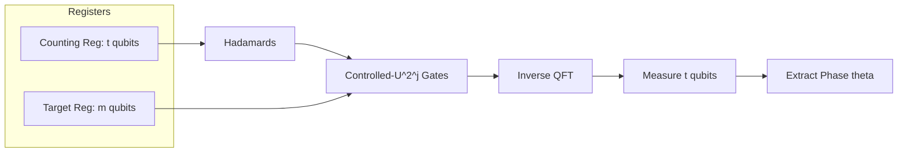

# Quantum Phase Estimation (QPE)

## Overview
**Quantum Phase Estimation (QPE)** is one of the most critical sub-routines in quantum computing. Given a unitary operator $U$ and an eigenstate $|\psi\rangle$ of $U$ such that:

$$U|\psi\rangle = e^{2\pi i \theta}|\psi\rangle$$

where $0 \le \theta < 1$, QPE estimates the value of the phase $\theta$ with high precision.

QPE is the mathematical core that powers many quantum algorithms showing exponential speedup:
*   **Shor's Algorithm** (where QPE is utilized for Order Finding/Period Finding)
*   **HHL Algorithm** (for solving systems of linear equations)
*   **Quantum Chemistry Simulations** (where it is used to measure the ground-state energies of molecular Hamiltonians)

---

## Mathematical Formulation & Workflow
The QPE circuit uses two main registers:
1.  **Counting Register** ($t$ qubits): Controls the unitary operations and stores the estimated phase $\theta$ after measurement.
2.  **Target Register** ($m$ qubits): Prepared in the eigenstate $|\psi\rangle$ of the unitary $U$.

The algorithm executes the following sequence:

### 1. Initialization and Superposition
The counting qubits are initialized to $|0\rangle^{\otimes t}$ and placed in a uniform superposition using Hadamard gates:

$$|\Psi_0\rangle = \frac{1}{\sqrt{2^t}}\sum_{x=0}^{2^t-1}|x\rangle |\psi\rangle$$

### 2. Controlled Unitary Applications
We apply controlled-$U^{2^j}$ operations where qubit $j$ of the counting register controls $U^{2^j}$ acting on the target register. Due to the eigenvalue property $U^{2^j}|\psi\rangle = e^{2\pi i \theta 2^j}|\psi\rangle$, this introduces phase terms directly to the control qubits (Phase Kickback):

$$|\Psi_1\rangle = \frac{1}{\sqrt{2^t}}\sum_{x=0}^{2^t-1} e^{2\pi i \theta x}|x\rangle |\psi\rangle$$

### 3. Inverse QFT (IQFT)
Applying the Inverse Quantum Fourier Transform (IQFT) to the counting register maps the phase amplitudes back into the computational basis. If $\theta$ can be represented exactly using $t$ bits (i.e. $\theta = s/2^t$ for some integer $s$), the state becomes:

$$|\Psi_2\rangle = |s\rangle |\psi\rangle$$

### 4. Measurement
Measuring the counting register yields the bitstring $s$ with 100% probability, from which we retrieve $\theta = s/2^t$. If $\theta$ is not exactly expressible in $t$ bits, the measurement yields the closest rational approximations with high probability.

---

## Circuit Structure Diagram

---

## Implementation & Shor's Algorithm Integration
*   **Implementation in Shor's Algorithm**: QPE acts as the quantum Order Finding engine. It prepares a target state in $|1\rangle$ (which is a superposition of the eigenstates of the modular multiplication operator $U_a|y\rangle = |ay \bmod N\rangle$) and measures the phase $\theta \approx s/r$, exposing the period $r$.
    *   **Module**: [`src/algorithms/shor.py`](../../../src/algorithms/shor.py)
    *   **Shor Specification**: [`docs/system/specs/08-shor_algorithm.md`](../../system/specs/08-shor_algorithm.md)
*   **Planned standalone module**: An interactive, standalone Jupyter Notebook exploring QPE in isolation is scheduled under Month 6: Advanced Algorithms II of the project roadmap.
    *   **Roadmap**: [`docs/roadmap/quantum-dev-roadmap.md`](../../roadmap/quantum-dev-roadmap.md)
