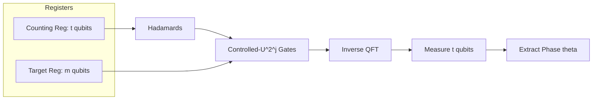

# Quantum Phase Estimation (QPE)

## Overview
**Quantum Phase Estimation (QPE)** is one of the most critical sub-routines in quantum computing. Given a unitary operator $U$ and an eigenstate $|\psi\rangle$ of $U$ such that:

$$U|\psi\rangle = e^{2\pi i \theta}|\psi\rangle$$

where $0 \le \theta < 1$, QPE estimates the value of the phase $\theta$ with high precision.

QPE is the mathematical core that powers many quantum algorithms showing exponential speedup:
*   **Shor's Algorithm** (where QPE is utilized for Order Finding/Period Finding)
*   **HHL Algorithm** (for solving systems of linear equations)
*   **Quantum Chemistry Simulations** (where it is used to measure the ground-state energies of molecular Hamiltonians)

---

## Mathematical Formulation & Workflow
The QPE circuit uses two main registers:
1.  **Counting Register** ($t$ qubits): Controls the unitary operations and stores the estimated phase $\theta$ after measurement.
2.  **Target Register** ($m$ qubits): Prepared in the eigenstate $|\psi\rangle$ of the unitary $U$.

The algorithm executes the following sequence:

### 1. Initialization and Superposition
The counting qubits are initialized to $|0\rangle^{\otimes t}$ and placed in a uniform superposition using Hadamard gates:

$$|\Psi_0\rangle = \frac{1}{\sqrt{2^t}}\sum_{x=0}^{2^t-1}|x\rangle |\psi\rangle$$

### 2. Controlled Unitary Applications
We apply controlled-$U^{2^j}$ operations where qubit $j$ of the counting register controls $U^{2^j}$ acting on the target register. Due to the eigenvalue property $U^{2^j}|\psi\rangle = e^{2\pi i \theta 2^j}|\psi\rangle$, this introduces phase terms directly to the control qubits (Phase Kickback):

$$|\Psi_1\rangle = \frac{1}{\sqrt{2^t}}\sum_{x=0}^{2^t-1} e^{2\pi i \theta x}|x\rangle |\psi\rangle$$

### 3. Inverse QFT (IQFT)
Applying the Inverse Quantum Fourier Transform (IQFT) to the counting register maps the phase amplitudes back into the computational basis. If $\theta$ can be represented exactly using $t$ bits (i.e. $\theta = s/2^t$ for some integer $s$), the state becomes:

$$|\Psi_2\rangle = |s\rangle |\psi\rangle$$

### 4. Measurement
Measuring the counting register yields the bitstring $s$ with 100% probability, from which we retrieve $\theta = s/2^t$. If $\theta$ is not exactly expressible in $t$ bits, the measurement yields the closest rational approximations with high probability.

---

## Circuit Structure Diagram


---

## Standalone QPE Implementation Details

The algorithm is fully implemented in [qpe.py](file:///c:/Antigravity/quantum-computing-study/src/algorithms/qpe.py) as a first-class, standalone, tested Python module.

### Core API Functions

*   `create_qpe_circuit(phi: float, n_counting: int) -> QuantumCircuit`
    *   Constructs the full QPE circuit (counting register size `n_counting` and 1 target qubit).
    *   Prepares the target qubit in the $|1\rangle$ eigenstate using an $X$ gate.
    *   Applies Hadamards on counting qubits to create an equal superposition.
    *   Applies controlled-$U^{2^j}$ operations on target, where the unitary is the phase rotation gate $U = P(2\pi\phi)$.
    *   Applies the modern inverse Fourier Transform: `QFTGate(n_counting).inverse()`.
    *   Appends measurements to the counting register.
*   `run_simulation(qc: QuantumCircuit, shots: int = 2048) -> Optional[Dict[str, int]]`
    *   Simulates the compiled circuit using modern Qiskit Aer `AerSimulator` and the high-fidelity `SamplerV2` primitive.
*   `solve_qpe(counts: Dict[str, int], n_counting: int) -> Tuple[float, str]`
    *   Interprets the measurement counts to decode the estimated phase $\phi_{est}$.
    *   Finds the most frequent bitstring, reverses or handles ordering, and decodes it: $\phi_{est} = \frac{\text{int}(b, 2)}{2^{n_{counting}}}$.

---

## Shor's Algorithm Integration

Beyond the standalone module, QPE acts as the quantum Order Finding engine in [shor.py](file:///c:/Antigravity/quantum-computing-study/src/algorithms/shor.py). It prepares a target state in $|1\rangle$ (which is a superposition of the eigenstates of the modular multiplication operator $U_a|y\rangle = |ay \bmod N\rangle$) and measures the phase $\theta \approx s/r$, exposing the period $r$.

*   **Shor Module**: [`src/algorithms/shor.py`](../../../src/algorithms/shor.py)
*   **Shor Specification**: [`docs/system/specs/08-shor_algorithm.md`](../../system/specs/08-shor_algorithm.md)

---

## Usage Example

```python
from src.algorithms.qpe import create_qpe_circuit, run_simulation, solve_qpe

# 1. Define real phase to estimate (e.g. 0.25 -> 1/4)
real_phi = 0.25
n_counting = 3  # QPE will be exact with 3 counting qubits

# 2. Build circuit
qc = create_qpe_circuit(real_phi, n_counting)

# 3. Simulate locally
counts = run_simulation(qc)

# 4. Decode the phase
est_phi, bin_str = solve_qpe(counts, n_counting)
print(f"Measured bitstring: |{bin_str}>")
print(f"Estimated phase: {est_phi:.5f} (Real phase: {real_phi:.5f})")
# Output: Measured bitstring: |010> and Estimated phase: 0.25000!
```

---

## Verification & Automated Tests

A comprehensive unit test suite is implemented in [test_qpe.py](file:///c:/Antigravity/quantum-computing-study/tests/test_qpe.py) verifying the mathematical correctness and physical success criteria:
*   `test_qpe_circuit_dimensions`: Ensures the circuit has exactly $t+1$ qubits and $t$ classical bits.
*   `test_exact_phase_estimation`: Validates that binary exact phases ($\phi \in \{0.5, 0.25, 0.125, 0.75\}$) are estimated with 100% precision.
*   `test_approximate_phase_estimation`: Validates that general irrational phases (e.g., $\phi = 1/3 \approx 0.33333$) successfully converge to the nearest binary fractions with bounded error ($\le \frac{1}{2^t}$).

