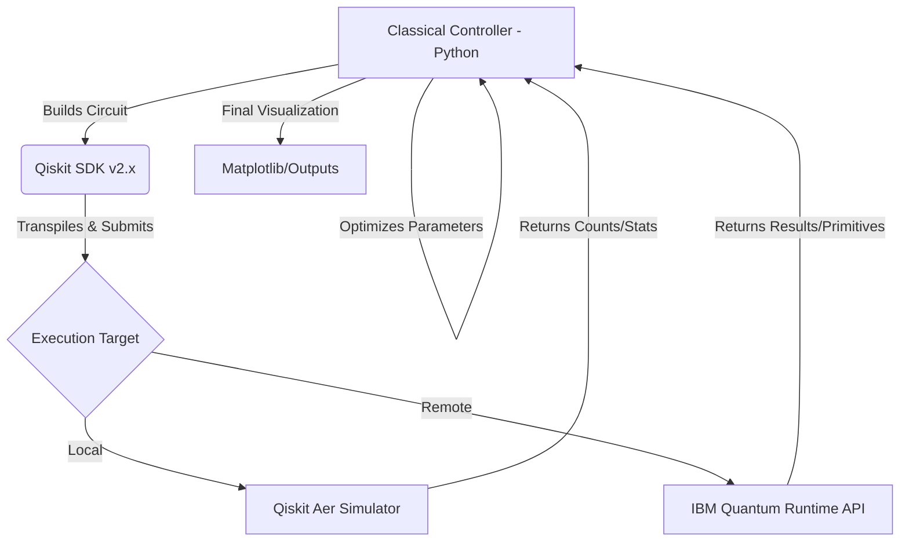

# System Architecture — Hybrid Quantum-Classical Pipeline 🏗️

This document describes the high-level design of the `quantum-computing-study` repository and how classical and quantum components interact.

## 1. High-Level Flow

The project follows a **Hybrid Programming Model**, where a classical controller (Python) manages the orchestration and optimization, while the quantum processor (or simulator) executes the specific circuits.

## 2. Component Breakdown

### 🛰️ Core Modules (`src/`)
- **Algorithms**: Implements standard oracles and logic gates.
- **QML (PennyLane)**: Handles variational layers and gradient-based training.
- **Optimization**: Manages the hybrid loop for VQE/QAOA.
- **Utils**: Handles noise models and results post-processing.

### 🔬 Execution Targets
- **Local (CPU/GPU)**: Used for rapid prototyping and noise-free simulations.
- **Remote (IBM Cloud)**: Used for the final Capstone project and real-hardware validation.

## 3. Data Flow
1. **Input**: Problem definition (e.g., a Hamiltonian for VQE or a dataset for QML).
2. **Processing**: Classical pre-processing and circuit construction.
3. **Execution**: Batch execution on the chosen target.
4. **Output**: Measurement results, visualization of the state (Bloch Sphere), or probability distributions.

---
*Last Updated: April 2026*
